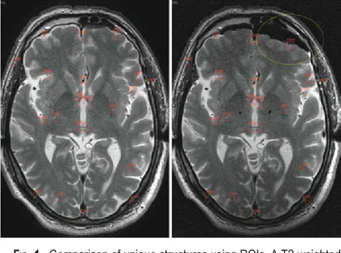

# MISR

[Medical Imaging, Simulation and Robotics Project]

---

## Intraoperative Brain-Shift Compensation

Ivan, Michael E. et al. “Brain shift during bur hole-based procedures using interventional MRI.” Journal of neurosurgery 121 1 (2014): 149-60 .

---

## Students

1. Alpha-Omar DIALLO
2. Belal HMEDAN
3. Christopher El-Zeinati
4. Youhana Mikhaiel

---

## Main Project Objective

Analyze existing and future assistance systems for Intraoperative Brain-shift compensation in our case.

---

### Project Describtion

1. a brief **introduction** of the **clinical context** (just to understand; your medical knowledge will not be evaluated!)
2. an **analysis** of one or several **existing computer-aided system(s)** in that context. This analysis must include **technical aspects, level of maturity** (for instance research project, clinical trials, commercial system), as well as **advantages** and any  **limitations**.
3. **improvements**, **modifications**, and **novel methods** that you could propose to overcome the challenges and limitations of these existing systems.

---

### Final presentation

1. 25 minutes per group, **maximum 10 min of presentation** + 15 min for questions
2. all groups will have to upload their slides before January 18, 2021.
3. presentations will be held on week 3 of 2021 (date to be announced).

---

### Timeline

| Date | Task |
| --- | ----------- |
| December 16, 2020 | Mid-term review (in class): topic, main elements of your analysis|
| January 19, 2021 | Slides submission (all groups)|
| January XX, 2021 | Final presentations (dates to be announced, during week 3)|
